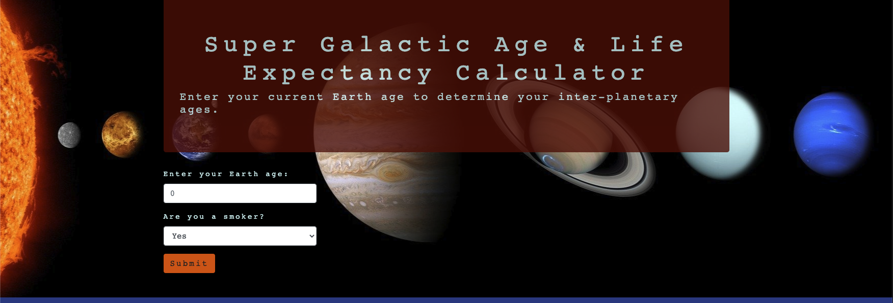

# Super Galactic Age Calculator

#### Test Driven Development & Environments with Javascript, Practice for Epicodus, 11.13.20

##### By Danielle Thompson

## Description
While a solar year lasts 365 days on planet Earth, no planet in our solar system shares the same solar year length. This application determines both a user's age and life expectancy for the planets Earth, Mercury, Venus, Mars, and Jupiter.

The life expectancy calculation is quite simple, and is just based on the United States' average life expectancy data from 2018 (see link below) plus demographic information about whether the user smokes or not. 

### References
Life Expectancy Data source (2018): [https://www.cdc.gov/nchs/fastats/life-expectancy.htm].

(For reference, please visit [Seeker](https://www.seeker.com/videos/space-innovation/how-long-could-you-survive-on-other-planets).

### Color theme
* _#2E3C8C (Med-dark blue)_
* _#CEF2F2 (Light blue)_
* _#F2600C (Orange)_
* _#590202 (Burnt red)_
* _#0D0D0D (Black)_

---

### Technologies used
* _ES6 Javascript_
* _Bootstrap_
* _jQuery_
* _node.js_ 
* _npm_
* _webpack_
* _ES Lint_
* _Jest_
* _Babel_

## Installation Requirements
This application requires the above technologies. If your local system does not include any of the listed technologies, please follow the instructions below to clone the project from GitHub to your local machine, as well as to set up your local machine to be able to view the cloned project. 

###### For Mac Users
* _Access Terminal in your Finder, and open a new window. Install the package manager, [Homebrew](https://brew.sh/), on your device by entering this line of code in Terminal: `$ /usr/bin/ruby -e "$(curl -fsSL https://raw.githubusercontent.com/Homebrew/install/master/install)"`._
* _Ensure Homebrew packages are run with this line of code: `echo 'export PATH=/usr/local/bin:$PATH' >> ~/.bash_profile`._
* _Once homebrew is installed, install Git, a version control system for code writers, with this line of code `brew install git`._
* _Now, install Node.js through Homebrew with the following command: `brew install node`._
* _Confirm that node and npm (Node's package manager that is automatically installed alongside Node) are on your working system with two command lines `node -v` & `npm -v`, respectively returning something resembling `v14.5.0` & `6.14.5` (or higher)._

###### For Windows Users
* _Open a new Command Prompt window by typing "Cmd" in your computer's search bar._
* _Determine whether you have 32-bit or 64-bit Windows by following these [instructions](https://support.microsoft.com/en-us/help/13443/windows-which-version-am-i-running)._
* _Go to [Git Bash](https://gitforwindows.org/), click on the "Download" button, and download the corresponding exe file from the Git for Windows site._
* _Follow the instructions in the set up menu._
* _Once you have Git installed on your computer, go to this [GitHub repository](https://github.com/dani-t-codes/super-galactic), click the "Fork" button in the upper right hand corner of the page, and clone this application with the following command:`git clone https://github.com/dani-t-codes/super-galactic`._
* _Go to the [Node.js website](https://nodejs.org/en/download/) and download the appropriate source code for your Windows operating system._ 

###### For Both Mac & Windows systems
* _Once the project has been cloned to your computer and you have all the necessary items on your local computer, open the project in the application of your choice ((Visual Code Studio)[https://code.visualstudio.com/] was used and is recommended by the application builder), and run `npm install` to get the appropriate dependencies from Node.js in the project._
* _Once Node's dependencies for the project have successfully downloaded, run the command `npm run build` in your terminal._
* _From there, you can run `npm run test` to run the package's test script(s)._
* _If you run `npm run start`, you will then be able to open a live session of the application._

---

### Specs
| Spec | Input | Output |
| :-------------     | :------------- | :------------- |
| **Homepage** | User accesses localhost:8080 | Homepage with user input form |
| **Program Gathers User Data** | User input: "age + demographic data" | Output: "planetary ages & life expectancies" |
| **Program Determines Mercury Age**| User Input: "Earth age * 0.24" | Output: "Mercury age" |
| **Program Determines Venus Age**| User Input: "Earth age * 0.24" | Output: "Venus age" |
| **Program Determines Mars Age**| User Input: "Earth age * 0.24" | Output: "Mars age" |
| **Program Determines Jupiter Age**| User Input: "Earth age * 0.24" | Output: "Jupiter age" |
| **Program Determines Earth Life Expectancy**| User Input: "Earth age" | Output: "Earth life expectancy" |
| **Program Determines Mercury Years Past Mercury Life Expectancy**| User Input: "Mercury age" | Output: "Mercury life expectancy" |
| **Program Determines Venus Years Past Venus Life Expectancy**| User Input: "Venus age" | Output: "Venus life expectancy" |
| **Program Determines Mars Years Past Mars Life Expectancy**| User Input: "Mars age" | Output: "Mars life expectancy" |
| **Program Determines Jupiter Years Past Jupiter Life Expectancy**| User Input: "Jupiter age" | Output: "Jupiter life expectancy" |
| **Program Displays User Data & Program Calculations**| User Input: "age + demographic data" | Output: "age + demographic data + planet ages & life expectancies" |

---

### Tests
Describe: earthlingData()
Expect: earthlingData (earthAge, T/F)

Describe: earthAge()
Expect: earthAge(30).toEqual(30)

Describe: mercuryAge() 
Test: mercuryAge(0.24 * earthAge)
Expect: mercuryAge(30).toEqual(7.2)

Describe: venusAge()
Test: venusAge(0.62 * earthAge)
Expect: venusAge(30).toEqual(18.6)

Describe: marsAge()
Test: marsAge(1.88 * earthAge)
Expect: marsAge(30).toEqual(56.4)

Describe: jupiterAge()
Test: jupiterAge(11.86 * earthAge)
Expect: jupiterAge(30).toEqual(355.8)

Describe: earthLifeExpectancy()
Test: 78.7 - earthAge
Expect: earthAge(30).toEqual(48.7)

Describe: smokerLE()
Test: if smokerStatus === 'true" { return earthLifeExpectancy - 8}
Expect: earthAge(30, 'true').toEqual(40.7)

Describe: mercuryLifeExpectancy()
Test: if mercuryAge > 2 minutes, then dead. 
Test: mercuryAge - 0
Expect: mercuryLifeExpectancy(mercuryAge = 7.2).toEqual(7.2y - 2m)

Describe: venusLifeExpectancy()
Test: if venusAge > 1 second, then dead. 
Test: venusAge - 0
Expect: mercuryLifeExpectancy(venusAge = 18.6).toEqual(18.6y - 1s)

Describe: marsLifeExpectancy()
Test: if marsAge > 2 minutes, then dead. 
Expect: marsLifeExpectancy(marsAge = 56.4).toEqual(56.4y - 2m)

Describe: jupiterLifeExpectancy()
Test: if jupiterAge > 0 seconds, then dead. 
Expect: jupiterLifeExpectancy(jupiterAge = 355.8).toEqual(355.8)

---

### Stretch Goals

Ideally, this application would take in more than just one pieces of demographic data from the user, and would include more data than just from the United States. Perhaps it could even benefit from the added use of an API that has pertinent mortality rate and/or life expectancy data. 

Other relevant demographic data could be fashioned in a similar way to the smokerStatus() method, where a new point of data would increase or decrease earthLifeExpectancy output. Potential data points could include: 
* Calendar year
* Country
* Region
* Gender
* Age group
* Socio-economic status
* Weight 
* Height 
* Education level 
* Marital status
* Retirement status 
* Annual income
* Frequency of exercise
* General health
* Alcoholic beverages per week. 

These and other potential factors will not be considered for the purposes of this application, simply for the sake of scope and brevity to the project's current purpose.

It might be possible to continue doing some refactoring work on the earthling data page with an ES6 class extend, to refactor the business logic into smaller chunks. The planetary ages and life expectancies returned to the user could also get limited to X number of decimal points with, perhaps using Javascript's built in .toFixed() method, or rounding up or down to a whole number with Math.Round(), .ceil(), or .floor() methods. 

## Known bugs

No known bugs at this time. 

### Legal, or License 

_MIT_ Copyright (c) 2020 **_Danielle Thompson_**
